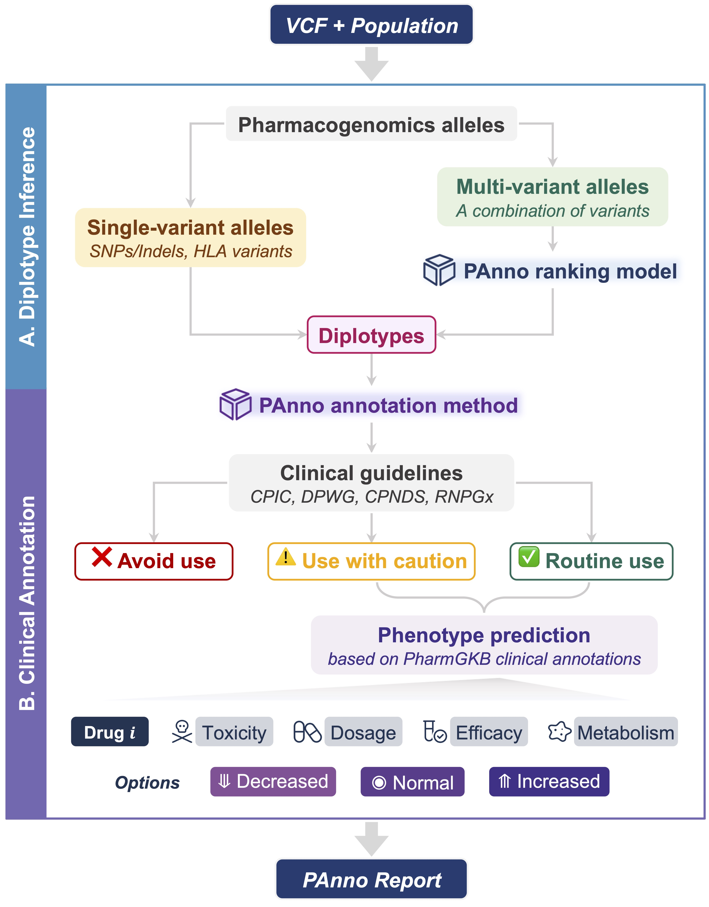
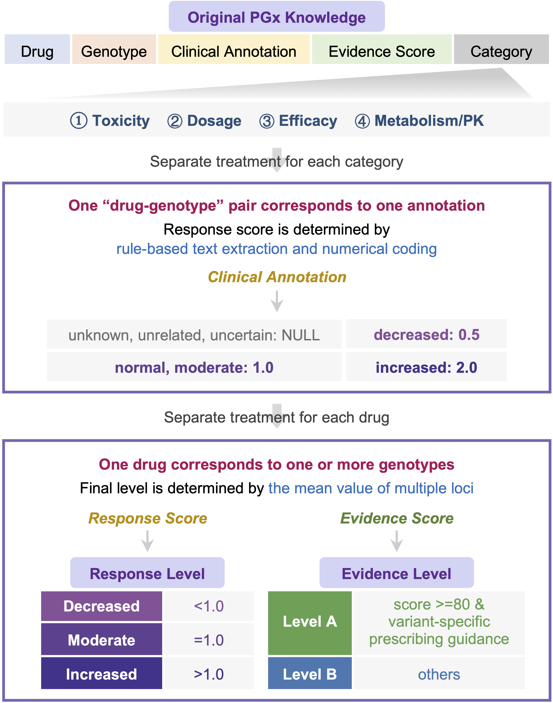

<p align="left">

</p>

## CPAT: Clinical Pharmacogenomics Annotation Tool
CPAT reports drug responses and prescribing recommendations by parsing the germline variant call format (VCF) file from NGS and the population to which the individual belongs. CPAT provides an end-to-end clinical pharmacogenomics decision support solution by resolving, annotating, and reporting germline variants in individuals.

A ranking model dedicated to inferring diplotype developed based on allele definitions and population allele frequencies was introduced in CPAT. The predictive performance for diplotype was validated in comparison with four similar tools using the consensus diplotype data of the Genetic Testing Reference Materials Coordination Program (GeT-RM) as ground truth.

An annotation method was further proposed to summarize ***the drug response level*** (<b>decreased</b>, <b>moderate</b>, and <b>increased</b>) and ***the level of clinical evidence*** (<b>A</b> and <b>B</b>) for the resolved genotypes.

<p align="center">

</p>

## Status
CPAT is still under _active development_. In the current release, you should only use it to evaluate whether CPAT will compile and run properly on your system. All information in the CPAT report is interpreted directly from the uploaded VCF file. Users recognize that they are using CPAT at their own risk.

## Prerequisite
- Bash
- Python3 >= 3.6

## Installation
You can install CPAT from PyPI using pip as follows:
```Shell
pip install cpat
```

Alternatively, you can install using Conda from the bioconda channel:
```Shell
conda install -c bioconda cpat
```

If you would like the development version instead, the command is:
```Shell
pip install --upgrade --force-reinstall git+https://github.com/PreMedKB/CPAT.git
```

## Usage
Once installed, you can use CPAT by navigating to your VCF file and entering the corresponding three-letter abbreviation of the population:

```Shell
cpat -s sample_id -i germline_vcf -p population -o outdir
```

### Input data
#### 1. Germline VCF file

CPAT directly uses the NGS-derived germline VCF file as input and assumes it has undergone quality control. Therefore, if the VCF file is of poor quality, inaccurate genotypes and inappropriate clinical recommendations may be reported.

CPAT requires the VCF file aligned to the GRCh38 reference genome given the increasing generality and the built-in diplotype definition dependency version.


#### 2. Population
There are nine biogeographic groups supported by CPAT:

**AAC** (African American/Afro-Caribbean), **AME** (American), **EAS** (East Asian), **EUR** (European), **LAT** (Latino), **NEA** (Near Eastern), **OCE** (Oceanian), **SAS** (Central/South Asian), **SSA** (Sub-Saharan African).

More information is available at https://www.pharmgkb.org/page/biogeographicalGroups.

Please use the ***three-letter abbreviation*** as input. This is to prevent errors caused by special symbols such as spaces.

### Output data

The report is created in `${sample_id}.html` at the `outdir` by default.

For more detailed instructions, run `cpat -h`.

## Examples
The test VCF files of 1000 Genomes Project are stored in _./data/vcf_ directory, and the corresponding CPAT reports are stored in _./data/report_ directory.

## Core Components
### CPAT ranking model for diplotype inference
Genotype resolution aims to extract the alleles of small variants (SNVs and Indels) and the diplotypes related to PGx from the user-submitted VCF file. CPAT processes the “GT” information to obtain all relevant single-locus genotypes. Afterwards, the genotypes of small variants will be passed to clinical annotation directly, while the genotypes related to diplotype definitions will be passed to the CPAT ranking model. The output diplotypes with the highest ranking will then be annotated.
<p align="center">

</p>

### CPAT annotation method for predicting drug response at individual level
This component aims to discover the “drug-genotype-response-evidence” relationship. CPAT annotation method translates the literal PGx knowledge about genotypes into quantitative scores. The association between multiple genotypes and a single drug is then further translated into an individual-level association with this drug. Then the individual responses to specific drugs are reported in terms of the strength of the response and the reliability of the evidence.
<p align="center">

</p>