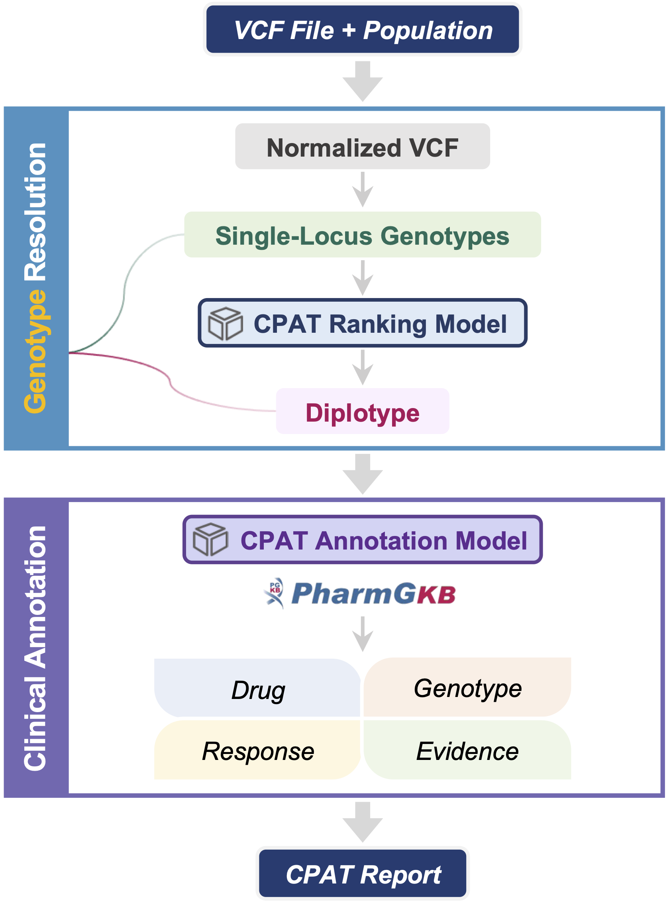
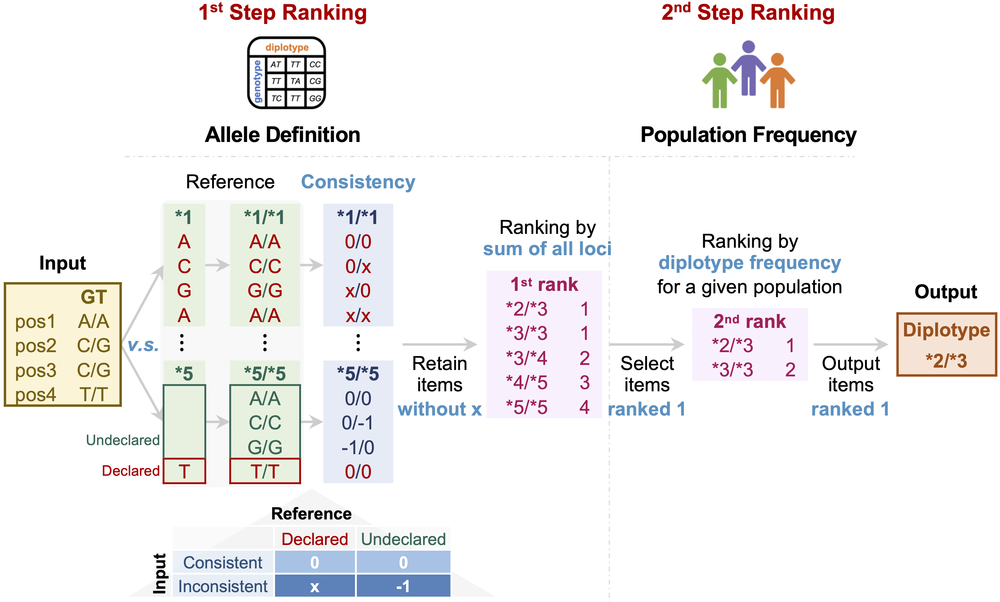
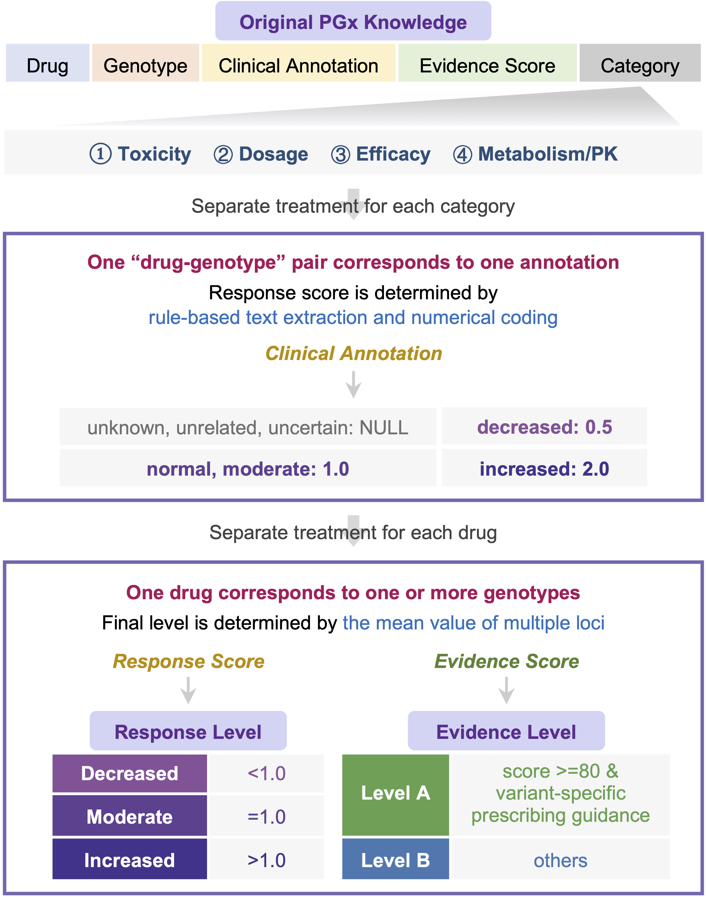

# CPAT

Clinical Pharmacogenomics Annotation Tool (CPAT) reports drug responses and prescribing recommendations by parsing the germline variant call format (VCF) file from NGS and the population to which the individual belongs. A ranking model dedicated to inferring diplotype developed based on allele definitions and population allele frequencies was introduced in CPAT. The predictive performance for diplotype was validated in comparison with four similar tools using the consensus diplotype data of the Genetic Testing Reference Materials Coordination Program (GeT-RM) as ground truth. An annotation method was further proposed to summarize ***the drug response level*** (<b>decreased</b>, <b>moderate</b>, and <b>increased</b>) and ***the level of clinical evidence*** (<b>A</b> and <b>B</b>) for the resolved genotypes. In summary, CPAT provides an end-to-end clinical pharmacogenomics decision support solution by resolving, annotating, and reporting germline variants in individuals.

<p align="center">

</p>

## Status
CPAT is still under _active development_. In the current release, you should only use it to evaluate whether CPAT will compile and run properly on your system. All information in the CPAT report is interpreted directly from the uploaded VCF file. Users recognize that they are using CPAT at their own risk.
## Prerequisite
- Bash
- Python3 >= 3.6
## Usage
```Bash
git clone https://github.com/PreMedKB/CPAT.git
cd cpat
python cpat.py -s sample_id -i germline_vcf -p population -o outdir
```
## Examples
The test VCF files of 1000 Genomes Project are stored in _./data/vcf_ directory, and the corresponding CPAT reports are stored in _./data/report_ directory.
## Input data
### VCF file
As the diplotype definitions only match to the human genome _GRCh38_ and given its increasing generality, CPAT requires that the VCF file is based on _GRCh38_.

CPAT directly uses the NGS-derived VCF file as input and assumes that it has undergone quality control. Therefore, if the VCF file is of poor quality, inaccurate genotype resolution results and inappropriate clinical recommendations may be reported.
### Population
There are nine biogeographic groups provided by CPAT: **AAC** (African American/Afro-Caribbean), **AME** (American), **EAS** (East Asian), **EUR** (European), **LAT** (Latino), **NEA** (Near Eastern), **OCE** (Oceanian), **SAS** (Central/South Asian), **SSA** (Sub-Saharan African). More information is available at https://www.pharmgkb.org/page/biogeographicalGroups.

Please use the *three-letter abbreviation* as input. This is to prevent errors caused by special symbols such as spaces.
## CPAT Models
### CPAT ranking model for diplotype inference
The aim of genotype resolution is to extract the alleles of small variants and the diplotypes related to PGx from the user-submitted VCF file. CPAT processes the “GT” information to obtain all relevant single-locus genotypes. Afterwards, the genotypes of small variants will be passed to clinical annotation directly, while the genotypes related diplotype definitions will be passed to CPAT ranking model. The output diplotypes with the highest ranking will then be annotated.
<p align="center">

</p>

### CPAT annotation model for predicting drug response at individual level
The aim of this component is to resolve the "drug-genotype-response-evidence" relationship. CPAT annotation model translates the literal PGx knowledge about genotypes into quantitative scores. The association between multiple genotypes and a single drug is then further translated into an individual-level association with this drug. Ultimately, individual responses to specific drugs are reported in terms of the strength of the response and the reliability of the evidence.
<p align="center">

</p>